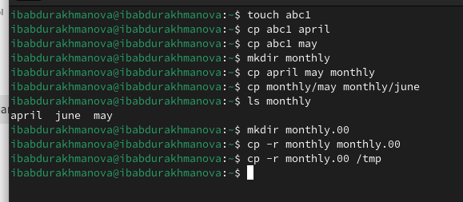
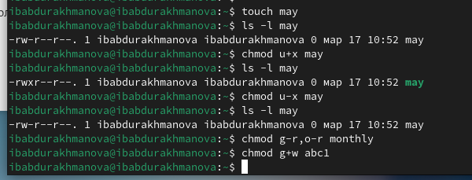
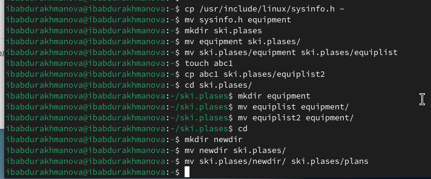
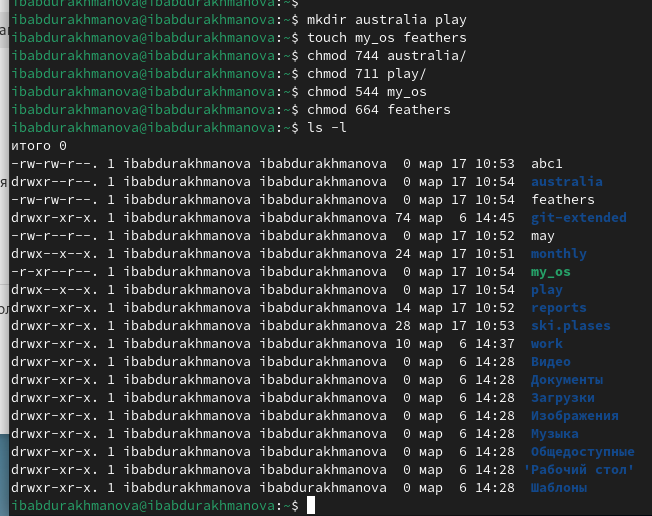
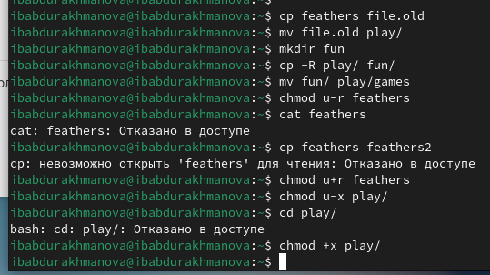
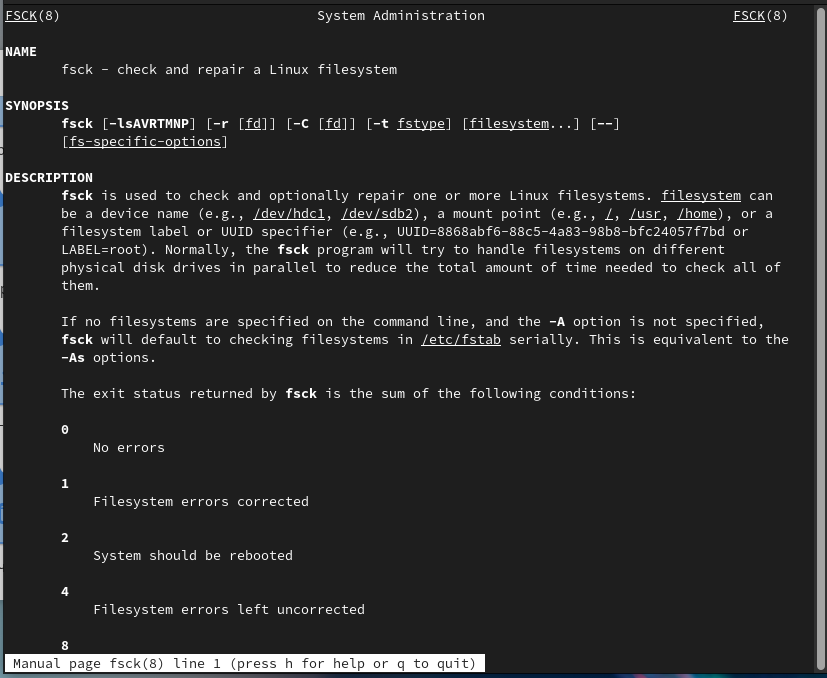

---
# Front matter
lang: ru-RU
title: "Отчёт по лабораторной работе №7"
subtitle: "Анализ файловой структуры UNIX. Команды для работы с файлами и каталогами"
author: "Абдурахмонова Рухшона Бахтиёровна	Нби бд 03-23"

# Formatting
toc-title: "Содержание"
toc: true # Table of contents
toc_depth: 2
lof: true # List of figures
fontsize: 12pt
linestretch: 1.5
papersize: a4paper
documentclass: scrreprt
polyglossia-lang: russian
polyglossia-otherlangs: english
mainfont: PT Serif
romanfont: PT Serif
sansfont: PT Sans
monofont: PT Mono
mainfontoptions: Ligatures=TeX
romanfontoptions: Ligatures=TeX
sansfontoptions: Ligatures=TeX,Scale=MatchLowercase
monofontoptions: Scale=MatchLowercase
indent: true
pdf-engine: lualatex
header-includes:
  - \linepenalty=10 # the penalty added to the badness of each line within a paragraph (no associated penalty node) Increasing the value makes tex try to have fewer lines in the paragraph.
  - \interlinepenalty=0 # value of the penalty (node) added after each line of a paragraph.
  - \hyphenpenalty=50 # the penalty for line breaking at an automatically inserted hyphen
  - \exhyphenpenalty=50 # the penalty for line breaking at an explicit hyphen
  - \binoppenalty=700 # the penalty for breaking a line at a binary operator
  - \relpenalty=500 # the penalty for breaking a line at a relation
  - \clubpenalty=150 # extra penalty for breaking after first line of a paragraph
  - \widowpenalty=150 # extra penalty for breaking before last line of a paragraph
  - \displaywidowpenalty=50 # extra penalty for breaking before last line before a display math
  - \brokenpenalty=100 # extra penalty for page breaking after a hyphenated line
  - \predisplaypenalty=10000 # penalty for breaking before a display
  - \postdisplaypenalty=0 # penalty for breaking after a display
  - \floatingpenalty = 20000 # penalty for splitting an insertion (can only be split footnote in standard LaTeX)
  - \raggedbottom # or \flushbottom
  - \usepackage{float} # keep figures where there are in the text
  - \floatplacement{figure}{H} # keep figures where there are in the text
---

# Цель работы

Ознакомление с файловой системой Linux, её структурой, именами и содержанием каталогов. Приобретение практических навыков по применению команд для работы с файлами и каталогами, по управлению процессами, по проверке использования диска и обслуживанию файловой системы.

# Выполнение лабораторной работы

1. Выполним примеры, приведённые в первой части описания лабораторной работы. 

{ #fig:001 width=70% }

{ #fig:002 width=70% }

{ #fig:003 width=70% }

2.1. Скопируем файл /usr/include/sys/io.h в домашний каталог и переименуем его equipment. Такого нет, взяли другой файл.

2.2. - 2.5. В домашнем каталоге создаем директорию ski.plases. и перемещаем в него файл equipment. Переименовываем файл equipment в equiplist. После этого создаем в домашнем каталоге файл abc1 и копируем его в каталог ski.plases. и переименовываем в equiplist2.
2.6. - 2.7. Создаем каталог с именем equipment в каталоге ski.plases. Перемещаем файлы equiplist и equiplist2 в каталог equipment.
2.8. Создаем и перемещаем каталог newdir в каталог ski.plases и называем его plans.

{ #fig:004 width=70% }

3. Определим опции команды chmod, необходимые для того, чтобы присвоить файлам из хода работы нужные права доступа.

a) Australia (drwxr--r--)
b) play (drwx--x--x)
c) My_oc (-r-xr--r--)
d) feathers (-rw-rw-r--)

{ #fig:005 width=70% }

4.1. Просмотрим содержимое файла /etc/passwd.

{ #fig:006 width=70% }

4.2 - 4.12. Выполним все указанные действия по перемещению файлов и каталогов 

{ #fig:007 width=70% }

4.7. Если мы попытаемся просмотреть файл feathers командой cat, то нам будет отказано в доступе.

4.8. Если мы попытаемся скопировать файл feathers то у нас не получется это сделать так как мы ограничили себя в доступе для чтения.

5. Прочитаем man по командам mount, fsck, mkfs, kill и кратко их охарактеризуем, приведя примеры.

{ #fig:008 width=70% }

Монтирование файловой системы к общему дереву каталогов. Для размонтирования используется команда unmonnt.

{ #fig:009 width=70% }

fsck (проверка файловой системы) – это утилита командной строки, которая позволяет выполнять проверки согласованности и интерактивное исправление в одной или нескольких файловых системах Linux. Она использует программы, специфичные для типа файловой системы, которую она проверяет. Вы можете использовать команду fsck для восстановления поврежденных файловых систем в ситуациях, когда система не загружается или раздел не может быть смонтирован.

{ #fig:010 width=70% }

Буквы в mkfs значке означают “make file system” (создать файловую систему). Команда обычно используется для управления устройствами хранения в Linux. Вы можете рассматривать mkfs как инструмент командной строки для форматирования диска в определенной файловой системе.

{ #fig:011 width=70% }

Системный вызов kill может быть использован для посылки какого-либо сигнала какому-либо процессу или группе процесса.

# Вывод

В ходе данной работы мы ознакомились с файловой системой Linux, её структурой, именами и содержанием каталогов. Научились совершать базовые операции с файлами, управлять правами их доступа для пользователя и групп. Ознакомились с Анализом файловой системы. А также получили базовые навыки по проверке использования диска и обслуживанию файловой системы.

# Контрольные вопросы

1. Дайте характеристику каждой файловой системе, существующей на жёстком диске компьютера, на котором вы выполняли лабораторную работу.           
Ответ:
Ext2FS (расширенная файловая система номер два). Многие годы ext2 была файловой системой по умолчанию в GNU/Linux. Ext2 заменила собой Extended File System (вот откуда появилось “Second” в названии). В “новой” файловой системе были исправлены некоторые проблемы, а также убраны ограничения. Отличная стабильность, комплексные инструментальные средства для спасения удаленных файлов, очень долгое время перезагрузки после аварии, есть вероятность частичной или полной потери данных после аварии. Одним из главных недостатков “традиционных” файловых систем, подобных Ext2FS, является низкая сопротивляемость к резким системным сбоям (сбой питания или авария программного обеспечения)

Ext3 (Расширенная файловая система номер три) - является наследником файловой системы Ext2FS. Ext3 совместима с Ext2, но обладает одной новой и очень интересной особенностью –запись. Процесс сохранения объекта происходит прежде чем запись в журнал. В результате мы получаем всегда последовательную файловую систему. Это приводит к тому, что при появлении проблем, проверка и восстановление происходят очень быстро. Время, потраченное на то, чтобы проверить файловую систему таким образом, пропорционально его фактическому использованию и не больше его размера.

ReiserFS (Это тоже журналируемая файловая система подобно Ext3FS, но их внутренняя структура радикально отличается. В ReiserFS используется концепция бинарных деревьев (binary-tree), позаимствованная из программного обеспечения баз данных.

JFS (журналируемая файловая система). JFS была разработана и использовалась IBM. Вначале JFS была закрытой системой, но недавно IBM решила открыть доступ для движения свободного программного обеспечения. Внутренняя структура JFS близка к ReiserFS. Средняя стабильность, нет комплексных инструментальных средств для спасения удаленных файлов, очень быстрая перезагрузка после аварии, очень хорошее восстановление данных после аварии.

2. Приведите общую структуру файловой системы и дайте характеристику каждой директории первого уровня этой структуры. 
Ответ:
	- Загрузочный блок занимает первый блок файловой системы. Только корневая файловая система имеет активный загрузочный блок, хотя место для него резервируется в каждой файловой системе.
	- Суперблок располагается непосредственно за загрузочным блоком и содержит самую общую информацию о ФС (размер ФС, размер области индексных дескрипторов, их число, список свободных блоков, свободные индексные дескрипторы и т. д.). Суперблок всегда находится в оперативной памяти. Различные версии ОСUnix способны поддерживать разные типы файловых систем. Поэтому у структуры суперблока могут быть варианты (сведения о свободных блоках, например, часто хранятся не как список, а как шкала бит), но суперблок всегда располагается за загрузочным блоком. При монтировании файловой системы в оперативной памяти создается копия ее суперблока. Все последующие операции по созданию и удалению файлов влекут изменения копии суперблока в оперативной памяти. Эта копия периодически записывается на магнитный диск. Обычно причиной повреждения файловой системы является отключение электропитания (или зависание ОС) в тот момент, когда система производит копирование суперблока из оперативной памяти на магнитный диск.
	- Область индексных дескрипторов содержит описатели файлов (inode). С каждым файлом связан один inode, но одному inode может соответствовать несколько файлов. Вinode хранится вся информация о файле, кроме его имени. Область индексных дескрипторов имеет фиксированный формат и располагается непосредственно за суперблоком. Общее число описателей и, следовательно, максимальное число файлов задается в момент создания файловой системы. Описатели нумеруются натуральными числами. Первый описатель используется ОС для описания специального файла (файла «Плохих блоков»). То есть поврежденные блоки раздела рассматриваются ОС как принадлежащие к специальному файлу и поэтому считаются «занятыми». Второй – описывает корневой каталог файловой системы.
	- В области данных расположены как обычные файлы, так и файлы каталогов (в том числе корневой каталог). Специальные файлы представлены в ФС только записями в соответствующих каталогах и индексными дескрипторами специального формата, т. е. места в области памяти не занимают.

3. Какая операция должна быть выполнена, чтобы содержимое некоторой файловой системы было доступно операционной системе?
Ответ: Команда cat - позволяет вывести на экран содержимое любого файла, однако в таком виде эта команда практически не используется. Если файл слишком большой, то его содержимое пролистается на экране, а Вы увидите только последние строки файла. С помощью этой команды можно комбинировать и объединять копии файлов, а также создавать новые файлы. Если набрать просто в командной строке cat и нажать Enter, то можно вводить (и соответственно видеть) текст на экране. Повторное нажатие клавиши Enter удвоит строку и позволит начать следующую. Когда текст набран, следует одновременно нажать клавиши Ctrl и d.

4. Назовите основные причины нарушения целостности файловой системы. Как устранить повреждения файловой системы?
Ответ: Некорректность файловой системы может возникать:
	- В результате насильственного прерывания операций ввода-вывода, выполняемых непосредственно с диском.
	- В результате нарушения работы дискового кэша. Кэширование данных с диска предполагает, что в течение некоторого времени результаты операций ввода-вывода никак не сказываются на содержимом диска — все изменения происходят с копиями блоков диска, временно хранящихся в буферах оперативной памяти (в этих буферах оседают данные из пользовательских файлов и служебная информация файловой системы, такая как каталоги, индексные дескрипторы, списки свободных, занятых и поврежденных блоков и т. п.)

5. Как создаётся файловая система?
Ответ:
	Общее дерево файлов и каталогов системы Linux формируется из отдельных "ветвей", соответствующих различным физическим носителям. В UNIX нет понятия "форматирования диска" (и команды форматирования), а используется понятие "создание файловой системы". Когда мы получаем новый носитель, например, жесткий диск, мы должны создать на нем файловую систему. То есть каждому носителю ставится в соответствие отдельная файловая система. Чтобы эту файловую систему использовать для записи в нее файлов, надо ее вначале подключить в общее дерево каталогов ("смонтировать"). Вот и получается, что можно говорить о монтировании файловых систем или о монтировании носителей (с созданными на них файловыми системами).
	Например, создается файловая система типа ext2fs. Создание файловой системы типа ext2fs подразумевает создание в данном разделе на диске суперблока, таблицы индексных дескрипторов и совокупности блоков данных. Делается все это все с помощью команды mkfs. В простейшем случае достаточно дать эту команду в следующем формате:
	
	[root]# mkfs -t ext2 /dev/hda5, где /dev/hda5 надо заменить указанием на соответствующее устройство или раздел. Например, если вы хотите создать файловую систему на дискете, то команда примет вид:

	[root]# mkfs -t ext2 /dev/fd0

	После выполнения команды mkfs в указанном разделе будет создана файловая система ext2fs. В новой файловой системе автоматически создается один каталог с именем lost+found. Он используется в экстренных случаях программой fsck, поэтому не удаляйте его. Для того, чтобы начать работать с новой файловой системой, необходимо подключить ее в общее дерево каталогов, что делается с помощью команды mount.
	В качестве параметров команде mount надо, как минимум, указать устройство и "точку монтирования". Точкой монтирования называется тот каталог в уже существующем и известном системе дереве каталогов, который будет теперь служить корневым каталогом для подключаемой файловой системы
	После монтирования файловой системы в каталог /mnt/disk2 прежнее содержимое этого каталога станет для вас недоступно до тех пор, пока вы не размонтируете вновь подключенную файловую систему. Прежнее содержимое не уничтожается, а просто становится временно недоступным. Поэтому в качестве точек монтирования лучше использовать пустые каталоги (заранее заготовленные).

6. Дайте характеристику командам, которые позволяют просмотреть текстовые файлы.
Ответ:
Для просмотра небольших файлов удобно пользоваться командой cat.
Формат команды: cat имя-файла

Для просмотра больших файлов используйте команду less — она позволяет осуществлять постраничный просмотр файлов (длина страницы соответствует размеру экрана).
Формат команды: less имя-файла

Для управления процессом просмотра можно использовать следующие управляющие клавиши:
- Space — переход на следующую страницу,
- ENTER — сдвиг вперёд на одну строку,
- b — возврат на предыдущую страницу,
- h — обращение за подсказкой,
- q — выход в режим командной строки.

Для просмотра начала файла можно воспользоваться командой head. По умолчанию она выводит первые 10 строк файла.
Формат команды: head [-n] имя-файла, где n — количество выводимых строк.

Команда tail выводит несколько (по умолчанию 10) последних строк файла.
Формат команды: tail [-n] имя-файла, где n — количество выводимых строк.

7. Приведите основные возможности команды cp в Linux.
Ответ:
Копирование отдельных файлов
Для копирования файла следует использовать утилиту cp с аргументами, представленными путями к исходному и целевому файлам.

Копирование файлов в другую директорию
В том случае, если в качестве пути к целевому файлу используется путь к директории, исходные файлы будут скопированы в эту целевую директорию.

Команда cp -r
Для копирования директорий целиком следует использовать команду cp -r (параметр -r позволяет осуществлять рекурсивное копирование всех файлов из всех поддиректорий).

Копирование множества файлов в директорию
Вы также можете использовать утилиту cp для копирования множества файлов в одну директорию. В этом случае последний аргумент (аргумент, указывающий на цель) должен быть представлен путем к директории.

Команда cp -i
Для предотвращения перезаписи существующих файлов в ходе использования утилиты cp следует использовать параметр -i (для активации интерактивного режима копирования).

8. Назовите и дайте характеристику командам перемещения и переименования файлов и каталогов.
Ответ:
Команды mv и mvdir предназначены для перемещения и переименования файлов и каталогов.
Формат команды mv: mv [-опции] старый_файл новый_файл
Примеры: 
	- Переименование файлов в текущем каталоге. Изменить название файла april на july в домашнем каталоге: cd mv april july
	- Перемещение файлов в другой каталог. Переместить файл july в каталог monthly.00: mv july monthly.00 ls monthly.00 Результат: april july june may. Если необходим запрос подтверждения о перезаписи файла, то нужно использовать опцию i.
	- Переименование каталогов в текущем каталоге. Переименовать каталог monthly.00 в monthly.01 mv monthly.00 monthly.01
	- Перемещение каталога в другой каталог. Переместить каталог monthly.01в каталог reports: mkdir reports mv monthly.01 reports
	- Переименование каталога, не являющегося текущим. Переименовать каталог reports/monthly.01 в reports/monthly: mv reports/monthly.01 reports/monthly

9. Что такое права доступа? Как они могут быть изменены?
Ответ:
Права доступа — совокупность правил, регламентирующих порядок и условия доступа субъекта к объектам информационной системы (информации, её носителям, процессам и другим ресурсам).
Права доступа к файлу или каталогу можно изменить, воспользовавшись командой chmod. Сделать это может владелец файла (или каталога) или пользователь с правами администратора.
Формат команды: chmod режим имя_файла Режим (в формате команды) имеет следующие компоненты структуры и способ записи: = установить право - лишить права + дать право r чтение w запись x выполнение u (user) владелец файла g (group) группа, к которой принадлежит владелец файла o (others) все остальные В работе с правами доступа можно использовать их цифровую запись (восьмеричное значение) вместо символьной	

